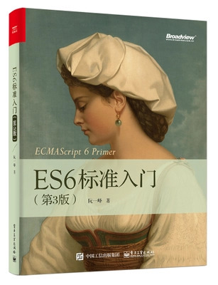

# ES6 入门教程

- [官方镜像](https://wangdoc.com/es6/)
- [JavaScript 教程](https://wangdoc.com/javascript)
- [TypeScript 教程](https://wangdoc.com/typescript)

《ECMAScript 6 入门教程》是一本开源的 JavaScript 语言教程，全面介绍 ECMAScript 6 新引入的语法特性。

本书覆盖 ES6 与上一个版本 ES5 的所有不同之处，对涉及的语法知识给予详细介绍，并给出大量简洁易懂的示例代码。

本书为中级难度，适合已经掌握 ES5 的读者，用来了解这门语言的最新发展；也可当作参考手册，查寻新增的语法点。如果你是 JavaScript 语言的初学者，建议先学完[《JavaScript 语言教程》](https://wangdoc.com/javascript/)，再来看本书。

全书已由电子工业出版社出版，2017年9月推出了第三版，书名为《ES6 标准入门》。纸版内容截止到出版时，网站内容一直在修订。

## 目录

1. [前言](README.md)
1. [ECMAScript 6简介](docs/02-intro.md)
1. [let 和 const 命令](docs/03-let.md)
1. [变量的解构赋值](docs/04-destructuring.md)
1. [字符串的扩展](docs/05-string.md)
1. [字符串的新增方法](docs/06-string-methods.md)
1. [正则的扩展](docs/07-regex.md)
1. [数值的扩展](docs/08-number.md)
1. [函数的扩展](docs/09-function.md)
1. [数组的扩展](docs/10-array.md)
1. [对象的扩展](docs/11-object.md)
1. [对象的新增方法](docs/12-object-methods.md)
1. [运算符的扩展](docs/13-operator.md)
1. [Symbol](docs/14-symbol.md)
1. [Set 和 Map 数据结构](docs/15-set-map.md)
1. [Proxy](docs/16-proxy.md)
1. [Reflect](docs/17-reflect.md)
1. [Promise 对象](docs/18-promise.md)
1. [Iterator 和 for...of 循环](docs/19-iterator.md)
1. [Generator 函数的语法](docs/20-generator.md)
1. [Generator 函数的异步应用](docs/21-generator-async.md)
1. [async 函数](docs/22-async.md)
1. [Class 的基本语法](docs/23-class.md)
1. [Class 的继承](docs/24-class-extends.md)
1. [Module 的语法](docs/25-module.md)
1. [Module 的加载实现](docs/26-module-loader.md)
1. [编程风格](docs/27-style.md)
1. [读懂规格](docs/28-spec.md)
1. [异步遍历器](docs/29-async-iterator.md)
1. [ArrayBuffer](docs/30-arraybuffer.md)
1. [最新提案](docs/31-proposals.md)
1. [Decorator](docs/32-decorator.md)
1. [参考链接](docs/33-reference.md)
1. [函数式编程](docs/34-fp.md)
1. [Mixin](docs/35-mixin.md)
1. [SIMD](docs/36-simd.md)
1. [Temporal API](docs/37-temporal.md)
1. [鸣谢](docs/38-acknowledgment.md)

## 其他

- [源码](https://github.com/ruanyf/es6tutorial/)
- [修订历史](https://github.com/ruanyf/es6tutorial/commits/gh-pages)
- [反馈意见](https://github.com/ruanyf/es6tutorial/issues)

### 版权许可

本书采用“保持署名—非商用”创意共享4.0许可证。

只要保持原作者署名和非商用，您可以自由地阅读、分享、修改本书。

详细的法律条文请参见[创意共享](http://creativecommons.org/licenses/by-nc/4.0/)网站。
